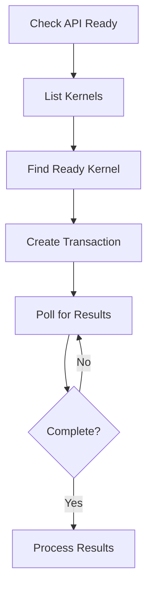
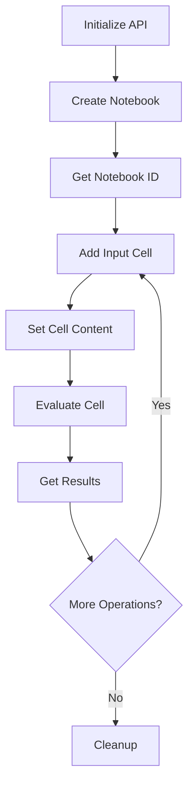

# WLJS Notebook API Documentation

Welcome to the comprehensive documentation for the WLJS (Wolfram Language Jupyter-style) Notebook API. This API enables external programs and large language models to interact with computational notebooks programmatically.

## Table of Contents

1. [Quick Start Guide](#quick-start-guide)
2. [API Overview](#api-overview)
3. [LLM Integration Patterns](#llm-integration-patterns)
4. [Common Workflows](#common-workflows)
5. [Error Handling](#error-handling)
6. [Best Practices](#best-practices)
7. [Code Examples](#code-examples)

## Quick Start Guide

### 1. Prerequisites

- WLJS server running on `http://127.0.0.1:20560` (default)
- Wolfram Language kernel available
- Basic understanding of REST APIs and JSON

### 2. First API Call

Always start by checking if the API is ready:

```bash
curl -X POST http://127.0.0.1:20560/api/ready/
```

Expected response:
```json
{"ReadyQ": true}
```

### 3. Basic Workflow Example

Here's a minimal example to create a notebook and execute code:

```python
import requests
import json
import time

base_url = "http://127.0.0.1:20560"

# 1. Check API readiness
response = requests.post(f"{base_url}/api/ready/")
print("API Ready:", response.json())

# 2. List available kernels
response = requests.post(f"{base_url}/api/kernels/list/")
kernels = response.json()
ready_kernel = next(k for k in kernels if k["ReadyQ"] and k["ContainerReadyQ"])
print("Using kernel:", ready_kernel["Hash"])

# 3. Create a transaction to execute code
payload = {
    "Kernel": ready_kernel["Hash"],
    "Data": "2 + 2"
}
response = requests.post(f"{base_url}/api/transactions/create/", 
                        json=payload)
transaction_hash = response.json()
print("Transaction created:", transaction_hash)

# 4. Poll for results
while True:
    response = requests.post(f"{base_url}/api/transactions/get/",
                           json={"Hash": transaction_hash})
    result = response.json()
    
    if result["State"] == "Idle":
        print("Result:", result["Result"])
        break
    elif result["State"] == "Error":
        print("Error occurred")
        break
    
    time.sleep(0.5)
```

## API Overview

The WLJS API is organized into several categories:

### Core Categories

1. **Health Checks** (`/api/ready/`): Verify API availability
2. **Kernels** (`/api/kernels/`): Manage computational kernels
3. **Transactions** (`/api/transactions/`): Execute code asynchronously
4. **Notebooks** (`/api/notebook/`): Manage notebook instances
5. **Cells** (`/api/notebook/cells/`): Manage individual cells
6. **Extensions** (`/api/extensions/`): Frontend extensions and resources
7. **Frontend Objects** (`/api/frontendobjects/`): Dynamic content management
8. **Utilities** (`/api/alphaRequest/`): Additional services

### Request Format

All POST requests expect JSON payloads:

```http
POST /api/endpoint/
Content-Type: application/json

{
  "parameter": "value"
}
```

### Response Format

Successful responses return JSON data with HTTP 200:

```json
{
  "field": "value"
}
```

Error responses return `"$Failed"` with HTTP 400:

```json
"$Failed"
```

## LLM Integration Patterns

This section provides specific patterns for large language models to interact with notebooks effectively.

### Pattern 1: Code Execution

The most common pattern for LLMs is executing Wolfram Language code:

```python
async def execute_code(code, kernel_hash):
    """Execute Wolfram Language code and return results."""
    
    # Create transaction
    payload = {"Kernel": kernel_hash, "Data": code}
    response = await post("/api/transactions/create/", payload)
    transaction_hash = response
    
    # Poll for completion
    while True:
        result = await post("/api/transactions/get/", {"Hash": transaction_hash})
        
        if result["State"] == "Idle":
            return result["Result"]
        elif result["State"] == "Error":
            raise Exception("Execution failed")
        
        await asyncio.sleep(0.3)
```

### Pattern 2: Notebook Management

For managing notebook state and structure:

```python
class NotebookManager:
    def __init__(self, base_url="http://127.0.0.1:20560"):
        self.base_url = base_url
        self.kernel_hash = None
        self.notebook_id = None
    
    async def initialize(self):
        """Set up kernel and notebook."""
        # Get ready kernel
        kernels = await self.post("/api/kernels/list/")
        self.kernel_hash = next(
            k["Hash"] for k in kernels 
            if k["ReadyQ"] and k["ContainerReadyQ"]
        )
        
        # Create notebook
        uuid = await self.post("/api/notebook/create/")
        await asyncio.sleep(1)  # Wait for creation
        self.notebook_id = await self.post("/api/notebook/create/pull/", {"Id": uuid})
    
    async def add_and_execute_cell(self, code):
        """Add a cell with code and execute it."""
        # Add cell
        await self.post("/api/notebook/cells/add/", {
            "Notebook": self.notebook_id,
            "Data": code
        })
        
        # Get the new cell (it will be the last one)
        cells = await self.post("/api/notebook/cells/list/", {
            "Notebook": self.notebook_id
        })
        new_cell = cells[-1]
        
        # Execute cell
        await self.post("/api/notebook/cells/evaluate/", {
            "Cell": new_cell["Id"]
        })
        
        return new_cell["Id"]
```

### Pattern 3: Interactive Development

For building interactive computational sessions:

```python
class InteractiveSession:
    def __init__(self):
        self.context = {}  # Track variables and state
        self.kernel_hash = None
    
    async def setup(self):
        """Initialize session."""
        kernels = await post("/api/kernels/list/")
        self.kernel_hash = next(
            k["Hash"] for k in kernels 
            if k["ReadyQ"] and k["ContainerReadyQ"]
        )
    
    async def execute_with_context(self, code):
        """Execute code while maintaining context awareness."""
        # Analyze code for variable assignments
        if "=" in code and not any(op in code for op in ["==", "!=", "<=", ">="]):
            var_name = code.split("=")[0].strip()
            self.context[var_name] = "defined"
        
        # Execute code
        result = await execute_code(code, self.kernel_hash)
        
        # Update context based on results
        self.analyze_result(result)
        
        return result
    
    def get_available_variables(self):
        """Return list of defined variables."""
        return list(self.context.keys())
```

### Pattern 4: Error Recovery

Handling errors gracefully:

```python
async def robust_execute(code, kernel_hash, max_retries=3):
    """Execute code with error recovery."""
    
    for attempt in range(max_retries):
        try:
            result = await execute_code(code, kernel_hash)
            return result
        except Exception as e:
            if attempt == max_retries - 1:
                # Final attempt - try to restart kernel
                await post("/api/kernels/restart/", {"Hash": kernel_hash})
                await asyncio.sleep(2)  # Wait for restart
                
                # Retry after restart
                try:
                    return await execute_code(code, kernel_hash)
                except:
                    raise Exception(f"Execution failed after {max_retries} attempts")
            
            await asyncio.sleep(1)  # Wait before retry
```

## Common Workflows

### Workflow 1: Simple Code Execution

For executing standalone Wolfram Language expressions:



**Implementation:**

```javascript
async function executeCode(code) {
    // 1. Verify API is ready
    const readyResponse = await fetch('/api/ready/', {method: 'POST'});
    const ready = await readyResponse.json();
    if (!ready.ReadyQ) throw new Error('API not ready');
    
    // 2. Get available kernels
    const kernelsResponse = await fetch('/api/kernels/list/', {method: 'POST'});
    const kernels = await kernelsResponse.json();
    const readyKernel = kernels.find(k => k.ReadyQ && k.ContainerReadyQ);
    
    // 3. Create transaction
    const transaction = await fetch('/api/transactions/create/', {
        method: 'POST',
        headers: {'Content-Type': 'application/json'},
        body: JSON.stringify({
            Kernel: readyKernel.Hash,
            Data: code
        })
    });
    const transactionHash = await transaction.json();
    
    // 4. Poll for results
    while (true) {
        const result = await fetch('/api/transactions/get/', {
            method: 'POST',
            headers: {'Content-Type': 'application/json'},
            body: JSON.stringify({Hash: transactionHash})
        });
        const data = await result.json();
        
        if (data.State === 'Idle') {
            return data.Result;
        } else if (data.State === 'Error') {
            throw new Error('Execution failed');
        }
        
        await new Promise(resolve => setTimeout(resolve, 300));
    }
}
```

### Workflow 2: Notebook-Based Development

For creating and working with persistent notebooks:



**Implementation:**

```python
class NotebookSession:
    def __init__(self, base_url="http://127.0.0.1:20560"):
        self.base_url = base_url
        self.session = requests.Session()
        self.kernel_hash = None
        self.notebook_id = None
    
    def setup(self):
        """Initialize the notebook session."""
        # Check readiness
        response = self.session.post(f"{self.base_url}/api/ready/")
        if not response.json()["ReadyQ"]:
            raise Exception("API not ready")
        
        # Get kernel
        response = self.session.post(f"{self.base_url}/api/kernels/list/")
        kernels = response.json()
        ready_kernel = next(
            (k for k in kernels if k["ReadyQ"] and k["ContainerReadyQ"]), 
            None
        )
        if not ready_kernel:
            raise Exception("No ready kernel available")
        self.kernel_hash = ready_kernel["Hash"]
        
        # Create notebook
        response = self.session.post(f"{self.base_url}/api/notebook/create/")
        uuid = response.json()
        
        # Wait and get notebook ID
        time.sleep(1)
        response = self.session.post(
            f"{self.base_url}/api/notebook/create/pull/",
            json={"Id": uuid}
        )
        self.notebook_id = response.json()
    
    def add_code_cell(self, code):
        """Add a new code cell to the notebook."""
        response = self.session.post(
            f"{self.base_url}/api/notebook/cells/add/",
            json={
                "Notebook": self.notebook_id,
                "Data": code
            }
        )
        return response.json()
    
    def get_cells(self):
        """Get all cells in the notebook."""
        response = self.session.post(
            f"{self.base_url}/api/notebook/cells/list/",
            json={"Notebook": self.notebook_id}
        )
        return response.json()
    
    def evaluate_cell(self, cell_id):
        """Evaluate a specific cell."""
        response = self.session.post(
            f"{self.base_url}/api/notebook/cells/evaluate/",
            json={"Cell": cell_id}
        )
        return response.json()

# Usage example
session = NotebookSession()
session.setup()

# Add and work with cells
session.add_code_cell("x = 5")
session.add_code_cell("y = x^2")
session.add_code_cell("Plot[Sin[t], {t, 0, 2*Pi}]")

cells = session.get_cells()
for cell in cells:
    if cell["Type"] == "Input":
        session.evaluate_cell(cell["Id"])
```

### Workflow 3: Frontend Object Interaction

For working with dynamic content and interactive elements:

```python
async def get_frontend_object(uid, kernel_hash=None):
    """Retrieve a frontend object with polling for resolution."""
    
    payload = {"UId": uid}
    if kernel_hash:
        payload["Kernel"] = kernel_hash
    
    while True:
        response = await post("/api/frontendobjects/get/", payload)
        
        if response["Resolved"]:
            return json.loads(response["Data"])
        
        await asyncio.sleep(0.3)
```

## Error Handling

### Common Error Scenarios

1. **API Not Ready**: Server starting up or unavailable
2. **No Ready Kernels**: Computational backend unavailable
3. **Invalid Parameters**: Malformed requests
4. **Execution Errors**: Syntax errors in Wolfram Language code
5. **Network Issues**: Connection problems

### Error Handling Patterns

```python
class APIError(Exception):
    def __init__(self, message, error_type=None):
        super().__init__(message)
        self.error_type = error_type

async def safe_api_call(endpoint, payload=None, retries=3):
    """Make API call with error handling and retries."""
    
    for attempt in range(retries):
        try:
            response = await post(endpoint, payload)
            
            # Check for API failure response
            if response == "$Failed":
                raise APIError(f"API call failed: {endpoint}")
            
            return response
            
        except requests.RequestException as e:
            if attempt == retries - 1:
                raise APIError(f"Network error after {retries} attempts: {e}")
            await asyncio.sleep(1)
        
        except json.JSONDecodeError:
            raise APIError("Invalid JSON response from API")

# Usage with error handling
try:
    result = await safe_api_call("/api/transactions/create/", {
        "Kernel": kernel_hash,
        "Data": "some code"
    })
except APIError as e:
    print(f"API Error: {e}")
    # Handle specific error types
    if "Network error" in str(e):
        # Retry later or switch to backup
        pass
    elif "API call failed" in str(e):
        # Check API status or parameters
        pass
```

## Best Practices

### 1. Connection Management

- Always check `/api/ready/` before starting operations
- Verify kernel availability with `/api/kernels/list/`
- Implement connection pooling for multiple requests
- Handle network timeouts gracefully

### 2. Resource Management

- Clean up transactions after use with `/api/transactions/delete/`
- Monitor kernel resource usage
- Restart kernels when they become unresponsive
- Limit concurrent operations to avoid overload

### 3. Code Execution

- Validate Wolfram Language syntax before execution
- Use appropriate timeouts for long-running computations
- Handle infinite loops and resource exhaustion
- Implement proper error recovery mechanisms

### 4. Performance Optimization

- Cache kernel information to avoid repeated API calls
- Use appropriate polling intervals (300ms recommended)
- Batch operations when possible
- Monitor API response times

### 5. Security Considerations

- Validate all input before sending to kernels
- Sanitize user-provided Wolfram Language code
- Implement rate limiting for external access
- Monitor for resource abuse

## Code Examples

### Example 1: Mathematical Computation

```python
async def solve_equation(equation):
    """Solve a mathematical equation using Wolfram Language."""
    
    # Prepare Wolfram Language code
    code = f"Solve[{equation}, x]"
    
    try:
        result = await execute_code(code, kernel_hash)
        
        # Extract solution from result
        if result and len(result) > 0:
            solution_data = result[0]["Data"]
            return solution_data
        else:
            return "No solution found"
            
    except Exception as e:
        return f"Error solving equation: {e}"

# Usage
solution = await solve_equation("x^2 - 4 == 0")
print(f"Solution: {solution}")
```

### Example 2: Data Visualization

```python
async def create_plot(function, domain):
    """Create a plot of a mathematical function."""
    
    code = f"Plot[{function}, {domain}]"
    
    result = await execute_code(code, kernel_hash)
    
    # The result will contain plot data that can be rendered
    if result and len(result) > 0:
        plot_result = result[0]
        if plot_result["Display"] == "graphics":
            return {
                "type": "plot",
                "data": plot_result["Data"],
                "display_type": plot_result["Display"]
            }
    
    return None

# Usage
plot = await create_plot("Sin[x]", "{x, 0, 2*Pi}")
if plot:
    print(f"Created plot: {plot['type']}")
```

### Example 3: Interactive Notebook

```python
class InteractiveNotebook:
    def __init__(self):
        self.session = NotebookSession()
        self.variables = {}
    
    async def setup(self):
        """Initialize the interactive notebook."""
        self.session.setup()
    
    async def execute_statement(self, statement):
        """Execute a statement and track variables."""
        
        # Add cell with the statement
        self.session.add_code_cell(statement)
        
        # Get the new cell and evaluate it
        cells = self.session.get_cells()
        new_cell = cells[-1]
        
        # Execute using transactions for better control
        result = await execute_code(statement, self.session.kernel_hash)
        
        # Track variable assignments
        if "=" in statement and not any(op in statement for op in ["==", "!=", "<=", ">="]):
            var_name = statement.split("=")[0].strip()
            self.variables[var_name] = "assigned"
        
        return {
            "cell_id": new_cell["Id"],
            "result": result,
            "variables": list(self.variables.keys())
        }
    
    async def get_variable_value(self, var_name):
        """Get the current value of a variable."""
        code = f"{var_name}"
        return await execute_code(code, self.session.kernel_hash)

# Usage
notebook = InteractiveNotebook()
await notebook.setup()

# Interactive session
result1 = await notebook.execute_statement("x = 10")
result2 = await notebook.execute_statement("y = x^2")
result3 = await notebook.execute_statement("Plot[x^2, {x, -5, 5}]")

print(f"Variables defined: {result3['variables']}")
```

### Example 4: Batch Processing

```python
async def batch_process(operations):
    """Process multiple operations efficiently."""
    
    # Group operations by type for optimization
    code_operations = []
    cell_operations = []
    
    for op in operations:
        if op["type"] == "execute":
            code_operations.append(op)
        elif op["type"] == "cell_add":
            cell_operations.append(op)
    
    results = []
    
    # Process code executions
    for op in code_operations:
        try:
            result = await execute_code(op["code"], kernel_hash)
            results.append({
                "operation": op,
                "result": result,
                "status": "success"
            })
        except Exception as e:
            results.append({
                "operation": op,
                "error": str(e),
                "status": "error"
            })
    
    # Process cell operations
    for op in cell_operations:
        try:
            # Add cell
            response = await post("/api/notebook/cells/add/", {
                "Notebook": op["notebook_id"],
                "Data": op["content"]
            })
            results.append({
                "operation": op,
                "result": response,
                "status": "success"
            })
        except Exception as e:
            results.append({
                "operation": op,
                "error": str(e),
                "status": "error"
            })
    
    return results

# Usage
operations = [
    {"type": "execute", "code": "2 + 2"},
    {"type": "execute", "code": "Plot[Sin[x], {x, 0, Pi}]"},
    {"type": "cell_add", "notebook_id": notebook_id, "content": "x = 5"}
]

results = await batch_process(operations)
for result in results:
    print(f"Operation: {result['operation']['type']}, Status: {result['status']}")
```

This comprehensive documentation provides everything needed to effectively use the WLJS API, with special focus on patterns that enable large language models to interact with computational notebooks programmatically.